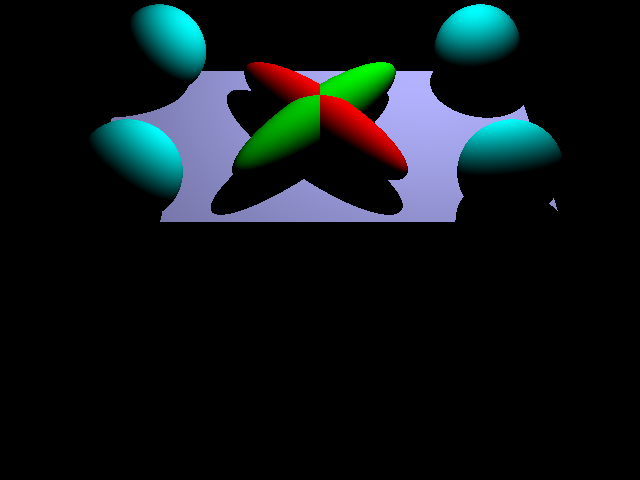
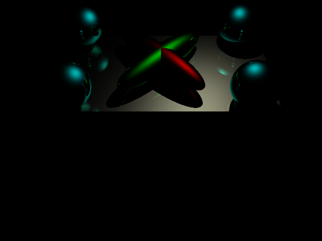
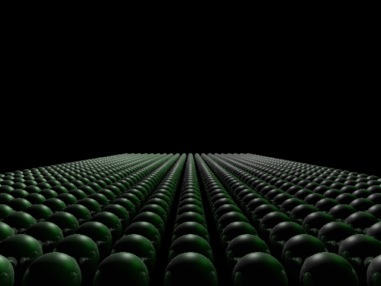
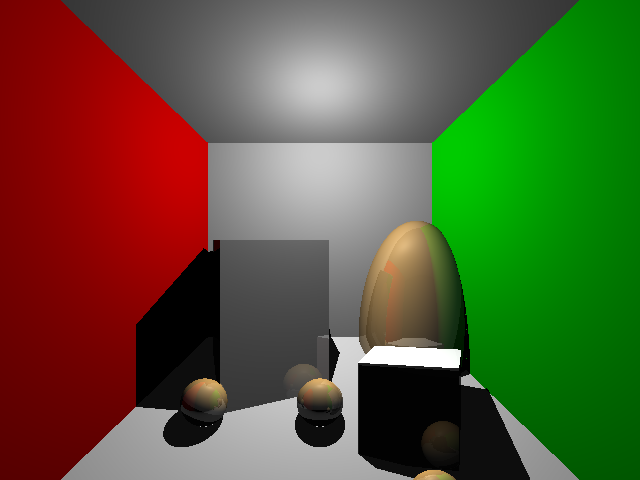
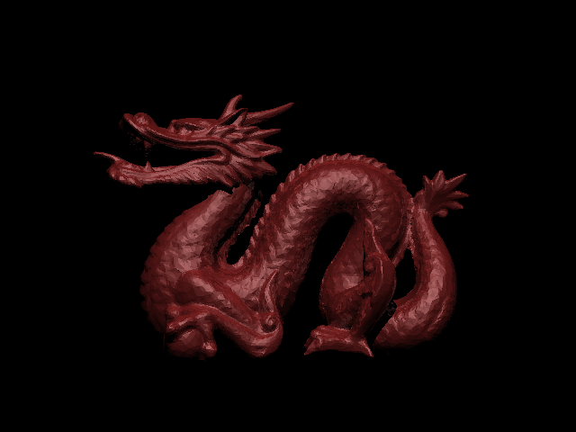

# RayTracer (CSE 167, Computer Graphics)

## Overview
This project is a simple raytracer developed as part of **CSE 167: Assignment 4** under Professor Ravi Ramamoorthi at UCSD. The goal of this assignment is to implement a basic raytracer capable of rendering scenes with shadows, reflections, and other effects.

## Features
- Ray-surface intersections (spheres, triangles, and planes)
- Recursive raytracing for reflections
- Basic lighting and shading
- Camera transformations
- Acceleration structures (e.g., uniform grid) for improved performance

## Project Structure
```
raytracer/
├── testscenes/            # Input files for testing (e.g., .test)
├── scene4-diffuse.png     # Output image for Scene 4 Diffuse
├── scene4-specular.png    # Output image for Scene 4 Specular
├── scene5.png             # Output image for Scene 5
├── scene6.png             # Output image for Scene 6
├── scene7.png             # Output image for Scene 7
└── README.md              # Project documentation
```

## Highlights: Rendered Scenes
Below are some of the rendered images produced by the raytracer:

### Scene 4
| Diffuse                      | Specular                      |
|------------------------------|-------------------------------|
|  |  |

### Other Scenes
- Scene 5:
   
- Scene 6:
  
- Scene 7:
   

## Getting Started

### Prerequisites
- C++17 compatible compiler (e.g., `g++`)
- `glm` library (ensure it’s included in your setup)
- `FreeImage` library 
- Make utility

## Running the Raytracer

Once built, execute the following command:

```bash
./raytracer [path_to_scene_file]
```
### Example

```bash
./raytracer assets/sample_test_files/scene1.test
```

### Output

The raytracer generates output images in the `output/` directory or directly overwrites existing files in `testscenes/`. Compare these outputs with the provided rendered images in the `testscenes/` directory for validation.

---

### Features and Extensions

#### Basic Features
- **Scene Rendering:** Supports triangles, spheres, and planes with recursive ray tracing.
- **Lighting Models:** Implements basic diffuse, specular, and emission shading.
- **Shadows:** Adds shadows using shadow rays.
- **Camera Transformations:** Supports different views for each test scene.

#### Acceleration Structures
- Implements a uniform grid for optimized ray-object intersection tests.

---

### Acknowledgements

- **CSE 167: Introduction to Computer Graphics**, UCSD
- Professor Ravi Ramamoorthi for providing the assignment and resources.
- **FreeImage Library** for image processing.
